# Stroke Prediction

---

You can see all the analysis and predictive models in the notebook `stroke_prediction.ipynb`. The dataset used is `healthcare-dataset-stroke-data.csv` from https://www.kaggle.com/datasets/fedesoriano/stroke-prediction-dataset.

---

## Problem Specification
- **Problem** : We use a dataset containing personal medical data from patients with an indication if whether or not they already suffered a stroke in the past. We are trying to predict if a given patient has a risk of having a stroke.

- **Use Case** : The reason to build such a model is important because according to the World Health Organization (WHO) stroke is the 2nd leading cause of death globally, responsible for approximately 11% of total deaths.Reference. Doctors and hospitals are the only environment (maybe big tech also) in which such a model could be utilized since it contains medical information from patients.

- **Dataset** : The dataset comes from kaggle. However, we do not know the true origin of the dataset. The reason is probably because of privacy and ethical reasons. The data records were probably aggregated at a regional hospital or doctor’s practice since it is not that big.

- **Target Users** : Predictive Model Both doctors and patients are the first target users of this predictive model that come to mind. They both work in tandem to provide and collect through a medical check the required (personal and sensitive) information about the patient. However, there are privacy considerations since the dataset contains medical data and the patient should give his/her informed consent to the data controller who holds the responsibility for compliance with the local privacy law (i.e. GDPR in the EU).

- **A Good Prediction** : In the case of prevention, it is better to have false positives than false negatives. If you find a risk of stroke and it turns out not to be the case, it’s not a big deal. But on the contrary, we do not want a stroke to occur when it was not predicted. Prevention is better than cure. The doctor wants his patient to be healthy. However, if the target user was an insurance company, we would have wanted very precise data, so we would also have sought to minimise false positives.

## Data Specification

We got the data set from the Kaggle website : https://www.kaggle.com/datasets/fedesoriano/stroke-prediction-data set. It’s a data set about Stroke Prediction. The given input variables x we can usenfor modelling are:
- `gender` - categorical data (”Male”, ”Female” or ”Other”)
- `age` - numerical discrete data
- `hypertension` - categorical data (0 or 1)
- `heart disease` - categorical data (0 or 1)
- `ever married` - categorical data (”No” or ”Yes”)
- `work type` - categorical data (”children”, ”Govt jov”, ”Never worked”, ”Private” or ”Self-employed”)
- `residence type` - categorical data (”Rural” or ”Urban”)
- `avg glucose level` - numerical continuous data
- `bmi` - numerical continuous data
- `smoking status`: categorical data (”formerly smoked”, ”never smoked”, ”smokes” or ”Un-known”)
The target variable y is `stroke` (1 if the patient had a stroke or 0 if not).

### Data cleaning

We observe that some values are missing for `bmi`, there are 201 Null observations out of the 5110. One option to deal with these missing values is to drop the samples with the missing values.
However, we can also simply replace these missing values with the mean BMI value of the respective gender for each sample.

Speaking of `genders`, we also remove all samples from the data set where gender is **Other** since these samples are a limiting factor for the model we will train in the predictive analysis part. Male and Female are the only two biological genders, so ’other’ will not help much in prediction if this feature tends to be a good predictor for a stroke.

### Quick check at stroke and non-stroke patients

We display the average values of each feature (numerical) for both stroke and non-stroke patients. The highest value between both classes is highlighted for each label.

  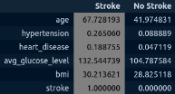

We observe that `age` and `avg glucose level` can be solid 1st hand indicators to identify a stroke. The mean age value of patients that suffered a stroke, 67.73, is much higher than those who did not suffer a stroke, 41.97. Similarly, avg glucose level value of 132.54 can indicate a higher chance of suffering from stroke than the avg glucose level value of 104.80 that has been found in patients that
did not suffer a stroke.

### Checking target imbalance

We can observe that the target is very imbalanced with less than 5% of the samples for which a stroke was registered. And an obvious reason is given by the fact that a stroke is a naturally unbalanced and ’quite rare’ occurrence, even if it is the second large cause of death worldwide. It is unrealistic to sample data from a group of people and have, for example, a fifty-fifty distribution of people who already have had a stroke and people not. 

Another reaction could be to say that we do not have enough data. Yet examples are plentiful of why more data is not always more valuable. Let aside, if the data is inaccurate, and by that we mean its characteristics, then the predictions of the model will be wrong too.

So more data for the prediction problem at hand is detrimental to the model’s performance if much of that data is not representative of the reality of the risk of strokes we are trying to predict. Specifically, we should not add more data about stroke patients into the dataset because it would not be representative. Note that we make a big assumption here that the dataset is accurate in the real world. 

We think the relevance of our data is correct to the problem of predicting strokes. The choice of a prediction algorithm afterwards should not really be important in that case.

  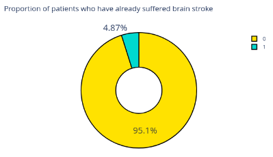

### Preprocessing

The the scikit-learn implementation does not support categorical variables so these need to be encoded. We employ two encoding methods, depending on the kind of categorical variable:
- **Ordinal encoding**: Each feature class is simply assigned an integer value. We apply it to ordinal variables.
- **One-hot encoding**: This is better to use for nominal (i.e. non-ordinal) data. It could otherwise be misleading to the model if we use the integer encoding for features without an ordinal relationship. There are some drawbacks but since the number of categories per feature is quite small (max. 5 for work type) we should be safe to use it. 

We do not encode the features hypertension and heart disease since they are already represented
numerically with 0 and 1.

### Build Train / Validation / Test set

Putting a testing set aside for post-development model testing. We use the train test split function from **scikit-learn** to randomly split the dataset. Since the function only splits a dataset’s feature matrix and label vector into two we apply it twice to get the desired train/val/test-split.
- `Train` : Data set model uses to learn and calibrate its parameters.
- `Valid` : Like a pre-test set used to evaluate the model fitted on training data and tweak the model’s hyperparameters.
- `Test` : Used to evaluate the final model.

To achieve such a split we employ a simple random split using two successive calls of train test split,
where we:
1. Split dataset into train and test; and
2. Cut a validation subset from the train data.

The following code snippet produces the split with proportions:
- train: 75%
- validation: 15%
- test: 10%

The parameter **stratify = df** y ensures an equal proportion of the target class stroke in the resulting samples as in the complete data set when splitting randomly.

This is especially important in our case since our target class is unbalanced. Otherwise, merely taking random samples may yield a different target class distribution in the train and validation sets then what stratified sampling may yield.

We check if the training set and validation set follow the same distribution by means of a **Q-Q plot** for features age, bmi, and avg glucose level.

    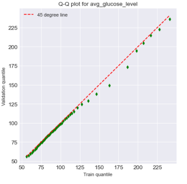
    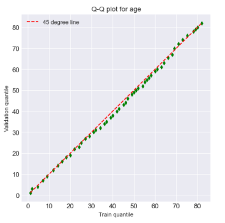
    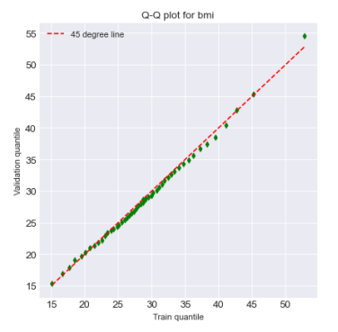

We observe that the points lie the 45° line. That means the validation and the training data set follow the same distribution for these three features.

## Despcriptive analysis

### Explore Numerical Variables

  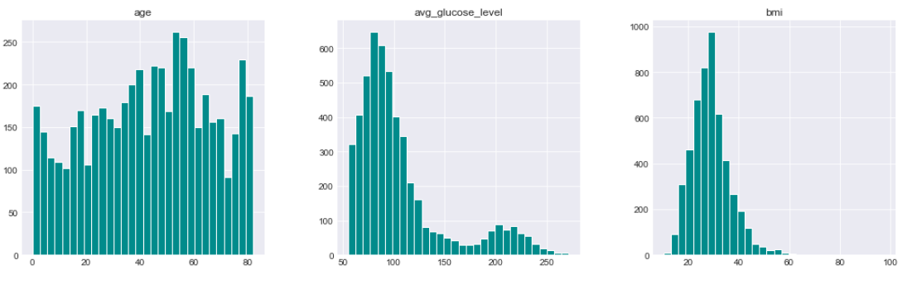

We observe that `age` is oddly distributed with peaks around 0, 60 & 80. Next, the `average glucose level` looks like a combination of two normal distributions with uneven heights. It is a bimodal distribution with modes at 90 and 200. Lastly, `bmi` values look normally distributed but is has a long right tail.

Furthermore, we looked in more detail at these features in relation to the target variable to get more meaningful observations from those.

  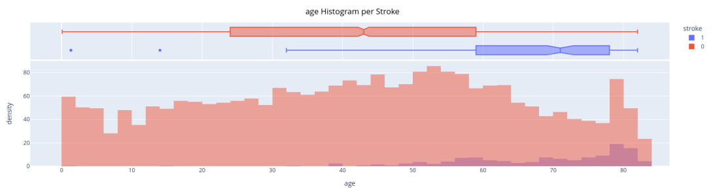

  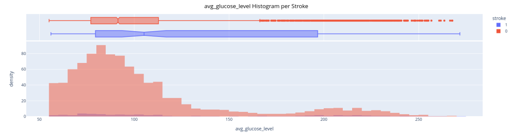

  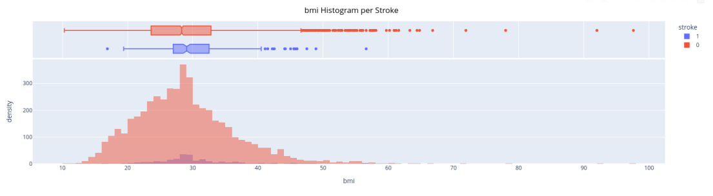

We observed that cases of stroke generally happen between `age` 40 and 80. Also, the `average glucose level` has still two modes and ranges between [50; 115] and [180; 235]. However, since the former group has the highest mode in the distribution they are more likely to suffer from a stroke than the latter group. Lastly, an average `bmi` value of 28 looks like the best predictive value for cases of stroke.

### Explore Categorical Variables

To visualise the categorical variables, we use count plots.

  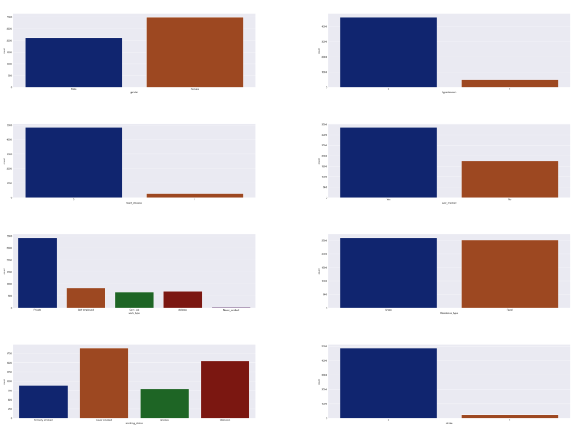

### Dependence between variables

In order to know which feature is relevant to use for prediction, it is important to see how much the feature is correlated to the target. Then, we tried to measure correlation with our own metrics with these methods :

- For `numerical x numerical` data : correlation matrix
- For `categorical x categorical` data : chi2 distance
- For `categorical x numerical` data : evaluate global standard deviation and standard deviation per class

Finally, we can plot mosaic plot to visualise the dependence.

  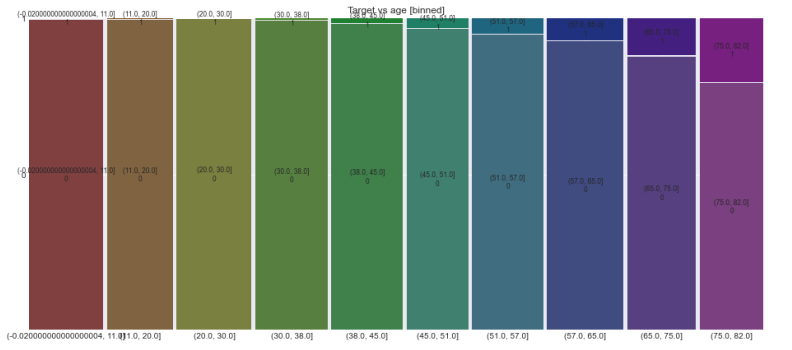

  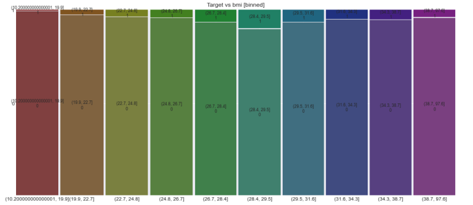

  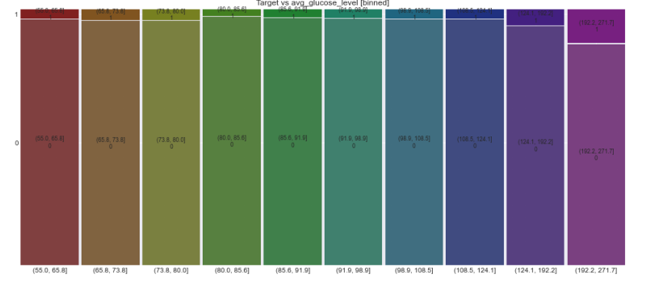

  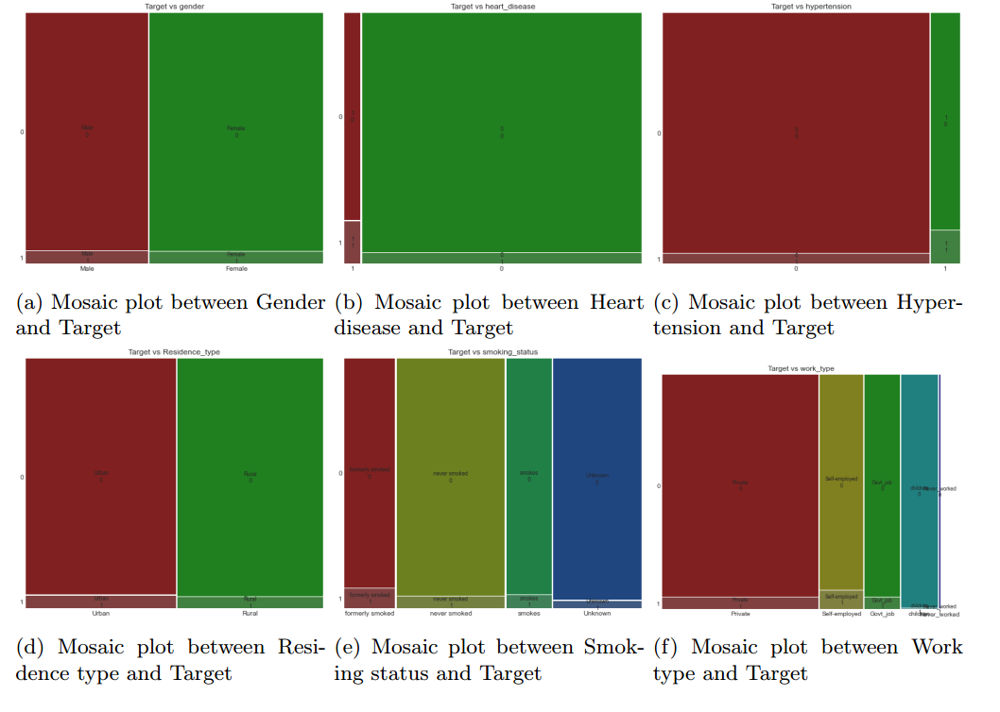

We see that the target is quite correlated with the following features : `age`, `avg glucose level`, `bmi`, `hypertension` and `heart disease`. Therefore, we will choose these features to train the predictive models.

### Describe selected variables
In this part, we focus on variables we chose for the prediction model : `age`, `bmi`, `avg glucose level`, `hypertension` and `heart disease`. We can describe these variables using statistics metrics :

  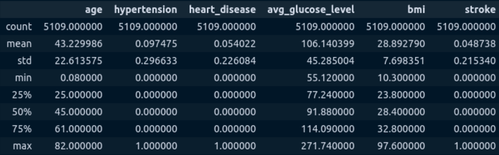

## Probability Distribution

We choose to use probability distribution for describe variables we chose for the prediction: `age`, `avg glucose level`, and `bmi`.

### Numerical variables
The variables `age`, `avg glucose level` and `bmi` are numerical, then we can try to describe them with a **Gaussian distribution**. The parameters for a Gaussian distribution are the **mean** µ and the
**standard deviation** σ.To estimate parameters we can use Maximum *Likelihood Estimation*. We also use the *Kernel Density Estimator* (KDE) technique to estimate the probability density of the random variable age, average glucose level and BMI.

  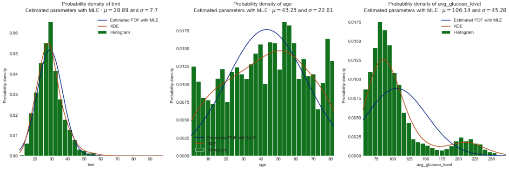

To verify if the variables and the estimated pdf follow the same distribution, we can use a *Q-Q plot*. For `age` and `bmi` it is approximately the same distribution, but not for the `avg glucose level`. We should use a better probability distribution.

  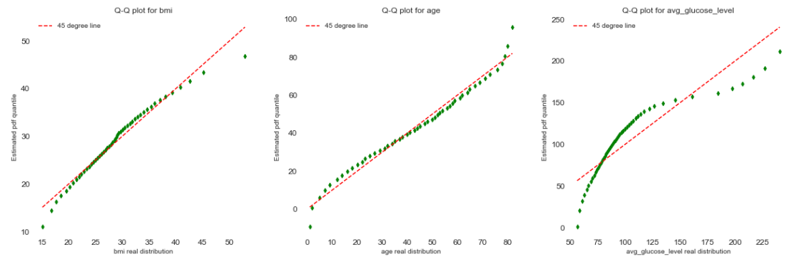

### Categorical variables
The variables `hypertension` and `heart disease` are binary categorical data. Then we can describe them with **Bernoulli distribution**. The parameter for a Bernoulli distribution is the **probability of success** p. To calculate this parameter we can calculate the success rate.

### Hypothesis testing

#### First Hypothesis Test

- `Null Hypothesis`: BMI levels are not significantly different for people with stroke
- `Alternative Hypothesis`: BMI levels are significantly different for people with stroke
- `Assumptions`: normal distribution of data

So we want to check how probable sample mean µ1 of the distribution of healthy people lies inside the normal distribution of the people with sample mean µ2.
- We pick 95% confidence level so our level of significance is α = 0.05
- H0: α ≤ p − value or The significance level is equal to or higher than p − value.
- Ha: α > p − value or The true mean difference is smaller than sigma.

The T-test is used to determine whether a numeric data sample differs significantly from the population or whether two samples differ from one another. A t-test will be conducted at a 95% confidence level and will be observed if it correctly rejects the null hypothesis that the sample comes from the same distribution. 

The test result shows the test statistic ”t” is equal to 3.7646477105748923. This test statistic tells us how much the sample mean deviates from the null hypothesis. If the t-statistic lies outside the quantiles of the t-distribution corresponding to our confidence level and degrees of freedom, we reject the null hypothesis and agree that they differ.

Since we had a result less than 0, 05 it tells us for the means to differ this much is so unlikely (meaning it is happening NOT by chance alone). Hence, we reject the null hypothesis with confidence
level of 95% and say BMI levels are significantly different for people with stroke according to our data.

We should keep in mind that in some cases when we ”do not reject H0”, it does not mean that we should believe that H0 is true. It simply means that the sample data have failed to provide sufficient evidence to cast serious doubt about the truthfulness of H0.

#### Second Hypothesis Test
In this second Hypothesis test we want to compare the effect of gender on this morbid condition. Our Set up can be seen below.
- `Null Hypothesis`: There is no relationship between gender and having a stroke
• `Alternative Hypothesis`: There is a relationship between gender and having a stroke

Chi-square tests are ideally suited to a data set in which both the variables to be compared are categorical. The Chi-square test is used to check whether the two characteristics are independent. It is used to determine whether a categorical outcome variable (Y) is related or associated with another categorical predictor variable (X)

We use the Independence Chi-Square Test. It decides whether two variables (factors) are inde- pendent or dependent. In this case there will be two qualitative survey questions or experiments and a contingency table will be constructed. The goal is to see if the two variables are unrelated (independent) or related (dependent). The null and alternative hypotheses are:
- H0: The two variables (factors) are independent.
- HA: The two variables (factors) are dependent.
  
`Assumptions` :
- The sample is drawn randomly from the population.
- Data is to be reported in raw frequencies (counts, not percentages)
- Observations are independent
- Variables are mutually exclusive (individuals cannot be assigned to more than one category) and exhaustive (include all possible contexts or categories)

Observed frequencies are not too small (n must be relatively large) in a 2 x 2 table; Chi-Square should not be used if n is less than 20 or any of the individual cell counts is less than 5.

The result was p ≥ α. Then, we can say that with data sample in our hand we concluded that gender has no specific role in stroke.

#### Third Hypothesis Test
In this third Hypothesis test we want to compare the effect of being obese on this morbid condition. Our Set up can be seen below.
- `Null Hypothesis`: There is no relationship between being obese and having a stroke
- `Alternative Hypothesis`: There is a relationship being obese and having a stroke
  
The result was p ≤ α. Then, we can say there is a relationship between being obese and having a stroke(reject H0).

#### Fourth Hypothesis Test
In this fourth Hypothesis test we want to compare the effect of age on this morbid condition. Our Set up can be seen below.
- `Null Hypothesis`: There is no relationship between being equal over 60 and having a stroke
- `Alternative Hypothesis`: There is a relationship being equal over 60 and having a stroke

The result was p ≤ α. Then, we can say there is a relationship between being equal over 60 and having a stroke(reject H0)

## Predictive Analysis

We are working on a classification problem for stroke prediction to predict the likelihood of a stroke for a new patient.
- `Positive class` : ”stroke” (smaller class)
- `Negative class` : ”no stroke” (larger class)

**Evaluation Metric**: Since the measurements are imbalanced and contain more negative data
(≈ 95%) than positive data (≈ 5%), we use the `precision` and `recall` evaluation metrics. They are more sensitive to getting the positive class (i.e. a stroke) right. Moreover we look at the `F1-score` which is a combination of the former two metrics. Accuracy would be a very bad choice because in 95% of the time our model would correctly predict the negative class since it is dominant.

Since we are in a medical context we need to try to reduce the false negatives (FN). However, it should not be a problem to have too many false positives (FP). A false negative (FN) diagnosis on the other hand falsely reassures a doctor and patient that there is no risk for a stroke.

`Precision` tells us how often the model was right when it classifies an instance as positive (i.e. having a stroke). We do not bother having particularly high precision since false positives are not
that worrisome for our case.

`Recall` tells us how often the model was right on all positive instances. And since we want to reduce the false negatives as much as possible we want to achieve high recall.

Plotting the three numerical features in 3D space can indicate whether or not stroke and non-stroke samples are separable by means of these features. As illustrated below there is no clear separation so we train the model using the categorical features as well.

  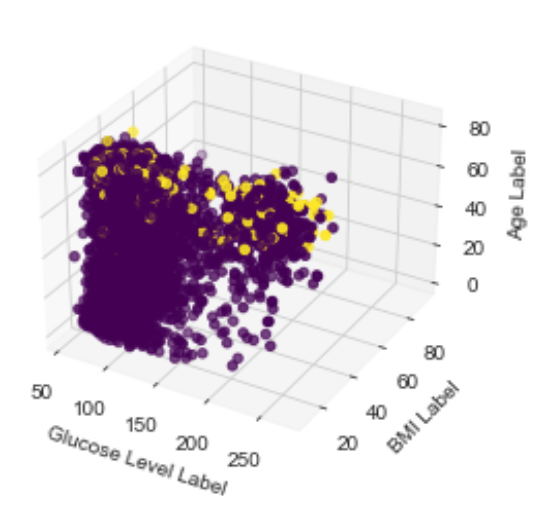

### K nearest neighbors
This algorithm assumes that all samples correspond to points in an n-dimensional space and the nearest neighbors of points are measured using the Euclidian distance. 

- ``Hyperparameters`` : The number of neighbors to check in the algorithm.
- ``Parameters`` : The nearest neighbors in the model.
  
We trained the model with the training data set for the selected variables age, bmi, avg glucose level, hypertension and heart disease. Then, we applied it to the validation set and this is the confusion matrix we obtain :

  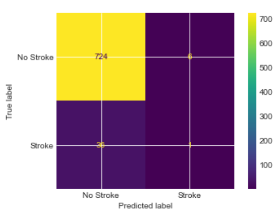

The **accuracy** is around 0.7 which is a good one. However we prefer to focus on the **F1-score** which is 0.045. The F1-score is very low, that means the model is not good for our use case.

### Logistic Regression
The name of the model is Logistic Regression. It is a statistical approach and a Machine Learning algorithm that is used for classification problems and is based on the concept of probability. It is used when the dependent variable (target) is categorical. It is widely used when the classification problem at hand is binary; true or false, yes or no, etc.

Logistics regression uses the **sigmoid function** to return the probability of a label. Sigmoid Function is a mathematical function used to map the predicted values to probabilities. The function has the ability to map any real value into another value within a range of 0 and 1.

These model also use a CostF unction to calculate the error, or the difference between our predicted value and the actual value.In order to minimize our cost, we use GradientDescent which estimates the parameters or weights of our model.

The `parameter` of the model is the training data

The model does not really have any critical `hyper parameters` to tune. Sometimes, you can see useful differences in performance or convergence with :
- **solver**: Algorithm to use in the optimization problem. [‘newton-cg’, ‘lbfgs’, ‘liblinear’, ‘sag’,‘saga’]
- **penalty**: The norm of the penalty. [‘none’, ‘l1’, ‘l2’, ‘elasticnet’]
- **C**: Inverse of regularization strength; must be a positive float. Like in support vector machines, smaller values specify stronger regularization. [100, 10, 1.0, 0.1, 0.01]

We can notice that logistic regression makes no assumption about the distribution of features. So the biomodal distribution of avg glucose level is not an obstacle for applying this prediction model. When we trained the model with the training set and applied to the validation test, we obtain the following results :

  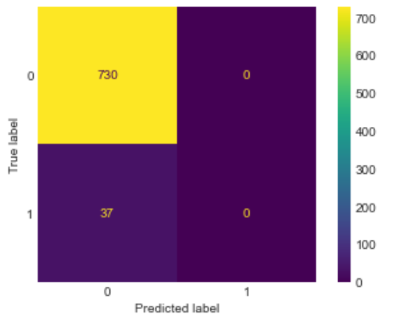

We did the calculation for the evaluation metrics :
- **Accuracy** : 0.8
- **Precision** : 0
- **Recall** : 0
- **F1 score** : 0
  
We obtain zero for the metrics because we don’t have ’no-stroke’ guesses from the model. The results we obtain are definitely not good. We have several False Negative cases, and we want to
avoid it. We have a quite good accuracy, but as we said before, it’s not a good metric for our use case.

### Conclusion for predictive models
Both models are not really good. However, with the K Nearest Neighbor model, we found stroke cases. And as we said, we prefer to have False Positive than False Negative cases. In conclusion, we prefer to use the K Nearest Neighbor model.

## Conclusion
We wanted to build a model in order to predict if a patient is likely to have a stroke or not. We did an analysis of the data to decide which features were the most relevant for the prediction. Unfortunately, we did not obtain good results with the prediction.

Our models are clearly limited. We still believe the class imbalance does not pose a problem. It may be probable that it is linked to another problem so we can attribute the bad performance of our prediction models to the scarcity of the data, as a consequence. Thus, for future work, we should try to find a solution to this problem. In that regard, the data is not really adequate. Moreover, future work could as well look into collecting data about blood pressure since it is, amongst others, an important factor for strokes. The WHO reference also states that smoking is important too to assess the risk of a stroke. Yet, our dataset contains samples with an unknown status for some patients and that may cause the model to learn incorrectly. Finally, there were no good correlations between the features and the target.